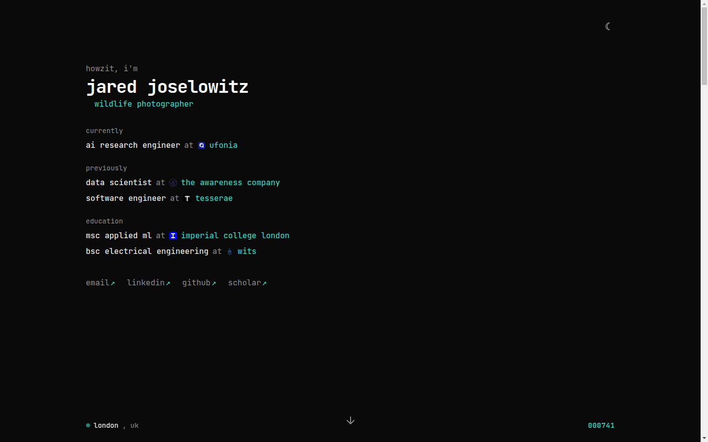

# jossy.co.za

Personal site of Jared Joselowitz — research engineer working on LLMs for healthcare. Single-page portfolio covering about, research & publications, and wildlife photography.

Live at **[jossy.co.za](https://jossy.co.za)**.



## Stack

- [Vite](https://vitejs.dev/) + React 18 + TypeScript
- Tailwind CSS with [shadcn/ui](https://ui.shadcn.com/) components (`src/components/ui`)
- React Router (`/` and a catch-all 404)

## Local development

Requires Node.js 20 (the version CI builds with).

```sh
npm install
npm run dev      # http://localhost:8080
```

Other scripts:

| Script | Purpose |
| --- | --- |
| `npm run build` | Production build to `dist/` |
| `npm run build:dev` | Build in development mode |
| `npm run preview` | Serve the production build locally |
| `npm run lint` | ESLint |

## Content

Almost all page content is hardcoded as constants in [`src/pages/Index.tsx`](src/pages/Index.tsx) — the cycling job titles, publications, experience, and photo grid. To add a publication, append to `PUBLICATIONS`:

```ts
{
  year: "2026",
  venue: "IWSDS 2026",
  title: "...",
  description: <>...</>,
  tags: ["#ASR", "#Clinical"],
  link: "https://arxiv.org/abs/...",
  status: "Published",        // or "Preprint" — renders a yellow badge
  presentation: "Oral",       // optional, renders a violet badge
  codeLink: "https://github.com/...",  // optional "View Code" button
}
```

Static assets (`cv.pdf`, `profile.jpeg`, `photos/`, `og-image.jpg`, `robots.txt`) live in `public/` and are served from the site root.

## Environment variables

The footer shows the most recent Last.fm track when these are set (create a `.env` locally; they're configured as repository secrets for CI):

```sh
VITE_LASTFM_API_KEY=...
VITE_LASTFM_USERNAME=...
```

Both are inlined into the client bundle at build time, so treat the key as public. The footer's visit counter uses [counterapi.dev](https://counterapi.dev/) and needs no configuration.

## Deployment

Hosted on GitHub Pages. Every push to `main` triggers [`.github/workflows/deploy.yml`](.github/workflows/deploy.yml), which builds with Node 20 and publishes `dist/` to the `github-pages` environment — no `gh-pages` branch involved.

The custom domain is configured in the repository's Pages settings (`jossy.co.za`, with `www` as a CNAME to `jaredjoss.github.io`) rather than via a `CNAME` file in the repo. HTTPS is enforced.
